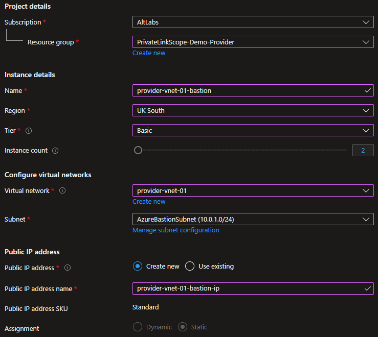
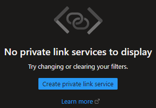
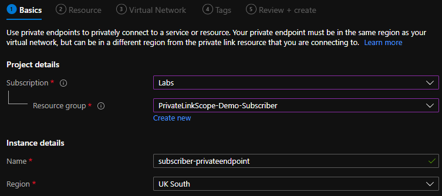
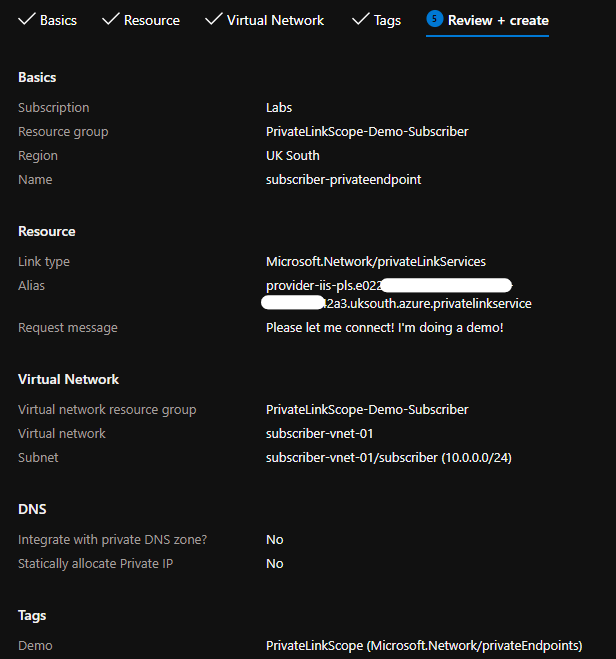

+++
author = "Matt Daines"
title = "Using Private Link Services for Connectivity Between Azure Tenants"
date = "2022-02-23"
description = "Using Private Link Services to enable private connectivity between a service in two or more Azure tenants."
tags = [
    "Azure Networking",
    "Azure Platform"
]
categories = [
    "Azure",
    "Azure Architecture",
    "Azure Networking"
]
series = ["azure-private-connections"]
aliases = ["azure-private-connections"]
+++

Hey there! In this post I'm going to talk about the design and implement of Private Link Services to enable private communication between a client in one Azure tenant to a service in one another tenant.
<!--more-->

### What is a Private Link?

First, the fundamentals. Private Link enables you to create Private **Endpoints** for PaaS services (Key Vault, Storage Accounts, etc) within your Azure virtual networks. This means services that are deployed or integrated within your Azure virtual network can communicate with that PaaS service over an endpoint that cannot be reached from the Internet. Using private endpoints to reduce the attack surface is quite common to contribute to a Defence in Depth strategy.

Private Link Services are another feature of Private Link that enables _you_ to provide a service and allow others to _subscribe_ to it over a private endpoint in their own network. Connections to a private endpoint never leave Microsoft's backbone over the Internet, even when the private endpoint is in a different Azure region to where the private link service is hosted.

One example of private link services is a SaaS provider that enables you to _subscribe_ to their private link service and enabling you to create a private endpoint within your Azure virtual network. A second example is when you deploy Azure Red Hat OpenShift (a Kubernetes managed cluster) it also creates a private link service and an endpoint that the cluster nodes use for reporting and logging back to Red Hat.

### When would I use a Private Link Service?

Software-as-a-Service is so incredibly broad that this private link service shaped shoe does not fit all. But there are certainly some providers where private link services could be beneficial. For example, if your service requires an agent to be installed on virtual machines to send data or telemetry back to your service also in Azure. If this connection is over a public endpoint that could be a deal breaker for regulated customers.

Some Azure customers opt for a multi-tenant deployment, for one reason or another. Private link services can enable systems/services in one of your tenants to consume an application in another potentially mitigating additional licence, compute, storage, and operational costs. If the customer has opted for multi-tenant, then that likely rules out virtual network peering (which, to my recent surprise, is possible between tenants!)

And for my third use case maybe your virtual networks are deployed as _islands_ (virtual networks that have no centralised connectivity) within a single tenant. Quite often these island virtual networks have overlapping address space which is problematic when a service in one virtual network needs to consume from a service in another virtual network as peering cannot be used. Private link services NATs the connection into the provider’s virtual network. So, from the providers point of view the connection _appears_ to come from their own network and not the subscriber’s network.

As the provider you can see the subscriber’s IP if you configure the TCP V2 proxy however your application will need to support the headers. If your application cannot parse the headers, then the connection will not be allowed. More information on [Microsoft Docs](https://docs.microsoft.com/en-gb/azure/private-link/private-link-service-overview#getting-connection-information-using-tcp-proxy-v2).

### Setting Up a Private Link Service

Right, now the hands on section! But first lets paint the picture of our scenario. The non-tech part is really a pick your own story:

- A single organisation uses multiple tenants to separate their pre-production and production environments. However, the Production environment needs to occasionally pull data from the pre-production system.
- An organisation has recently acquired another company and needs to quickly integrate systems between services in two tenants.
- Developers within an organisation deploy their applications to virtual network pods/islands, all configured with `10.0.0.0/16` networks but need to send health probes to another service with overlapping address space.

Fundamentally, what we're going to setup is a `Provider` virtual machine that's running IIS and a `Subscriber` virtual machine in another virtual network in another tenant. After all is configured the `subscriber` virtual machine will be able to see the IIS site without using public domain names or public IP addressing.

If you're familiar with the process of the steps detailed below feel free to skip over the details. I've summarised what you need at the top of each section and then go into detail for each step to support any beginners that come across the article.

**Setting Up The Infrastructure**

1) [Setup the Provider Virtual Network](#create-the-provider-virtual-network)
2) [Create a Windows Azure Virtual Machine](#create-the-provider-virtual-machine)
3) [Create the Subscriber Infrastructure](#create-the-subscriber-infrastructure)
4) [Install IIS and open HTTP](#configure-the-provider-virtual-machine)
5) [Create an internal Azure load balancer](#create-and-configure-an-internal-load-balancer-for-the-provider-service)
6) [Create a Private Link Service](#create-your-provider-private-link-service)

**Request The Private Link Service**

7) [Requesting Access to a Private Link Service](#requesting-access-to-a-private-link-service)
8) [Provider Approval](#provider-approval)

**Testing the Connection**

9) [Loading IIS from the Subscriber tenant/network](#testing-the-connection)

#### Create the Provider Virtual Network

Quick Setup Steps:

- Create a virtual network with two subnets named:
    - `AzureBastionSubnet`
    - `Provider`
- Deploy a `basic` sku Azure Bastion to the virtual network.
- The address space you use doesn't matter. It can overlap with your subscriber network when we get to provisioning that.

[Next Step - Create the Provider VM](#create-the-provider-virtual-machine) OR follow the detailed steps below:

#### Create the Provider Virtual Machine

Quick Setup Steps:

- Create a Windows Server virtual machine capable of installing the IIS role.
- The virtual machine should not have a public IP address.

[Next Step - Create the Subscriber Infrastructure](#create-the-subscriber-infrastructure) OR follow the detailed steps below:

#### Create the Subscriber Infrastructure

Quick Setup Steps:

- Create another virtual network in either a different tenant or the same tenant as your provider with two subnets named:
    - `AzureBastionSubnet`
    - `Subscriber`
- Provision Azure Bastion to this new virtual network
- Deploy a virtual machine capable of launching a browser (OS agnostic)

[Next Step - Configure the Provider Virtual Machine](#configure-the-provider-virtual-machine) OR follow the detailed steps below:

To setup the provider infrastructure you need to repeat [Create the Provider Virtual Network](#create-the-provider-virtual-network) and [Create the Provider Virtual Machine](#create-the-provider-virtual-machine) but swap provider for subscriber when setting names.

This subscriber/client infrastructure can be in the same tenant or a different tenant to the provider and can have overlapping address space with the provider's virtual network. I'll be using overlapping address space with my demo. If you're doing the same double check that the address space is set as `10.0.0.0/16`. If you're deploying to the same subscription as your provider Azure might detect this space is already used and default to `10.1.0.0/16`.

#### Configure the Provider Virtual Machine

Quick Setup Steps:

- Using Bastion, connect to the `provider-vm`
- Install the IIS role with default options
- Open port 80

[Next Step - Create and configure an internal load balancer for the Provider Service](#create-and-configure-an-internal-load-balancer-for-the-provider-service) OR follow the detailed steps below:

#### Create and Configure an Internal Load Balancer for the Provider Service

Quick Setup Steps:

- Create a `Standard`, `Internal`, `Regional` Azure load balancer in your provider network
- Add a single frontend in your Provider subnet
- Add the provider virtual machine into the backend pool
- Create a load balancer rule on port 80 with a HTTP:80 health probe

[Next Step - Create your Provider Private Link Service](#create-your-provider-private-link-service) OR follow the detailed steps below:

#### Create your Provider Private Link Service

Quick Setup Steps:

- In the provider tenant create a `Private Link Service` from the [Private Link Center](https://portal.azure.com/#blade/Microsoft_Azure_Network/PrivateLinkCenterBlade/overview).
- The name of the private link scope forms part of an alias that is shared to enable others to connect to the service. The naming convention looks like: `<name>.<guid>.<region>.azure.privatelinkservice`
- Select the internal load balancer you created earlier.
- For the NAT subnet select the Provider virtual network and subnet. This is the subnet that network interfaces are deployed to for the private link service's outbound connections. At the time of writing, there can be a maximum of 8 NAT IPs.
- Ensure Enable TCP Proxy V2 is set to **No**.
- Private IP Address settings is where you configure how many NAT interfaces to deploy. For the demo, I've left just one interface.
- For this demo we're testing (or at least simulating) a multi-tenant connection. So I've chosen the `Restricted by subscription` option for access.
- Using `Anyone with your alias` means you cannot setup auto-approvals. All approvals need to be approved when using anyone. `Restricted by subscription` allows you to configure auto-approvals from known and expected subscriptions.
- Once deployed, copy the alias into your clipboard. You'll need it in the next step!

[Next Step - Requesting Access to a Private Link Service](#requesting-access-to-a-private-link-service) OR follow the detailed steps below:

![Select the load balancer we created earlier and use the Provider subnet to host network interfaces for the services network interfaces. These network interfaces are created to NAT the incoming connections. Up to 8 can be created per private link service and this scaled with outbound flows. The number of interfaces is configured under Private IP Address Settings. For the demo we won't enabled V2 proxy. The V2 proxy allows the provider to see the private IP address of the connecting clients though the application needs to support a specific configuration that we're not covering in this document.](imgs/07-PLS/03-Create-Outbound.png)

#### Requesting Access to a Private Link Service

Quick Setup Steps:

- In the subscriber tenant create a `Private Endpoint` specifying the resource group, name of the private endpoint, and the region to deploy the endpoint to (it should be the same as your subscriber virtual network... Which does not have to be in the same region as your provider!)
- For Connection Method, paste the alias you copied from the Private Link Service in the step before.
- Enter a Request Message, if you'd like.
- Select the virtual network and subnet the private endpoint should be deployed to and select create.
- Once deployed, grab the private IP address of the private endpoint. We'll need it for testing soon!

[Next Step - Provider Approval](#provider-approval) OR follow the detailed steps below:

#### Provider Approval

Quick Setup Steps:

- Back in the provider tenant go to [Pending Connection](https://portal.azure.com/#blade/Microsoft_Azure_Network/PrivateLinkCenterBlade/pendingconnections) in the Private Link Center.
- Approve/Reject the request from the private endpoint created in the step before.
- If you approved that should be reflected in the Private Endpoints blade.

[Next Step - Testing the Connection](#testing-the-connection) OR follow the detailed steps below:

#### Testing the Connection

Quick Setup Steps:

- If you don't have it already, find the IP address of the private endpoint in the subscriber network.
- Using Bastion, connect onto your subscriber virtual machine. If you're logging onto a Windows Server box, turn off `IE Enhanced Security Configuration`.
- Launch the browser and navigate to `http://<private endpoint IP>`
- Hopefully, you're looking at ISS default page utilising a Private Link Service connection!

### Wrapping Up

Questions? Feel free to use Disqus at the bottom of the post, or my socials on [Twitter](https://twitter.com/MatthewDaines1) or [LinkedIn](https://www.linkedin.com/in/matthew-daines/).

If something didn't work how it was supposed to, do let me know and I'll go through and try to replicate and fix the guide.

Hope you found this useful, _catch ya_!

### Trivia and Afterthoughts

- Azure Private Link went Globally Available on the 4th November 2019 ([GA Annoucement](https://azure.microsoft.com/en-us/updates/azure-private-link-is-now-available-in-all-regions/))
- In the screenshots my resource group names are `PrivateLinkScope-Demo-*`. Notice the mistake? It's Private Link Service, not Private Link Scope! I noticed near the end capturing all of the screenshots and there are far too many screenshots to repair. I've had [Azure Monitor Private Link Scopes](https://docs.microsoft.com/en-gb/azure/azure-monitor/logs/private-link-configure) on my mind and made the typo 🤦🏻‍♂️
- I want to investigate what else you can serve behind a Private Link Scope. Can you query DNS? Join a domain? I want to discover it's limitations.
